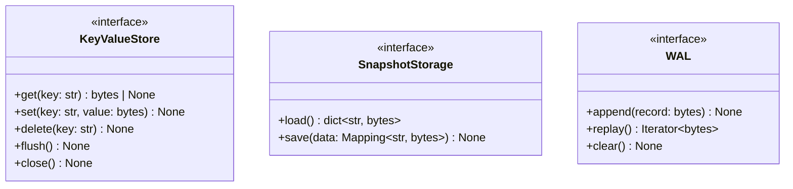

## Контракты базы

```mermaid
classDiagram
  class KeyValueStore {
    <<interface>>
    +get(key: str) bytes | None
    +set(key: str, value: bytes) None
    +delete(key: str) None
    +flush() None
    +close() None
  }
  class SnapshotStorage {
    <<interface>>
    +load() dict~str, bytes~
    +save(data: Mapping~str, bytes~) None
  }
  class WAL {
    <<interface>>
    +append(record: bytes) None
    +replay() Iterator~bytes~
    +clear() None
  }
```
