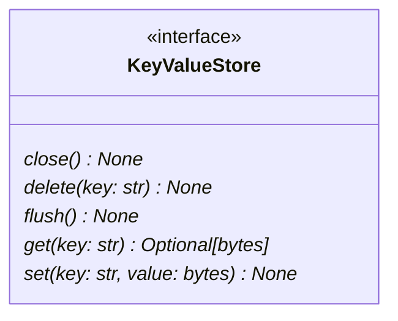

## Классы

```mermaid
classDiagram
  class KeyValueStore {
    <<interface>>
    close()* None
    delete(key: str)* None
    flush()* None
    get(key: str)* Optional[bytes]
    set(key: str, value: bytes)* None
  }
```